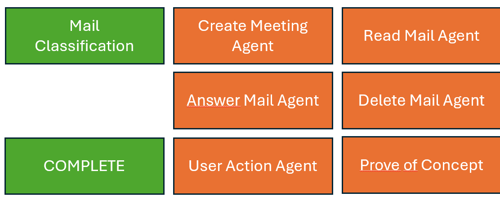
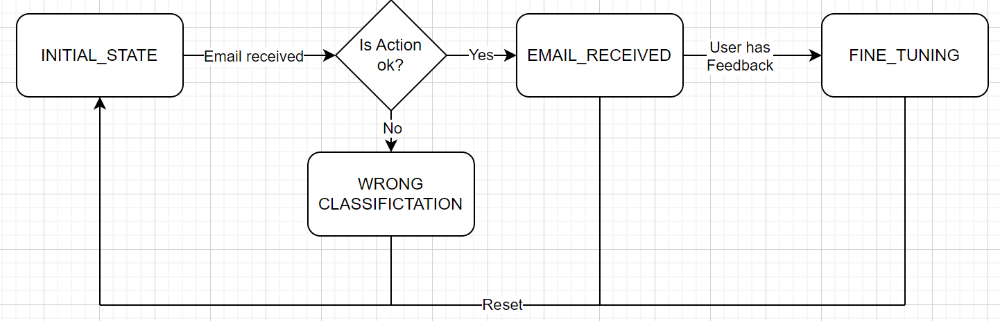

# Email Assistant

Author: Gsteiger Dominik (gsteidom@students.zhaw.ch)
Module: Machine Learning 2
Semester: FS24

## Table of Contents

1. Setup
2. Project Goal / Motivation
3. Data Collection or Generation
4. Modeling
5. Interpretation and Validation
6. Future work & expansions

## 1. Setup

1. Clone Git Repository
2. Setup local python environment (venv) with python version 3.10.0
3. Install requirements <br/>
   ``` pip install -r requirements.txt```
4. Create .env file with the following variable <br/>
   Email Assistant uses GPT-3.5-Turbo. Use your own OPENAI_API_KEY or request a OPENAI_API_KEY per mail. <br/>
   ```OPENAI_API_KEY='REPLACEME'```
5. Run app with ```python app.py``` or with ```flask run```
6. Go to url printed in console or  http://127.0.0.1:5000 and have fun :)

## 2. Project Goal / Motivation

Reading and deciding what to do with emails consumes a significant amount of our time daily.
The volume of spam emails is continuously increasing, requiring users to identify and manage them.
There are also numerous emails that simply require scheduling an appointment in Outlook and nothing more.

Additionally, the sheer volume of emails can be overwhelming, leading to important messages being overlooked or delayed
in response.
Users often struggle to prioritize emails based on urgency and importance, causing inefficiencies in communication and
task management.
Furthermore, manually sorting, categorizing, and responding to emails can lead to errors and inconsistencies.

An AI that first classifies emails and then takes appropriate action could be very helpful,
especially if it operates fully autonomously within the inbox.
However, achieving full autonomy for the AI is still a long way off.

As a first step and proof of concept, a chat interface should be developed where an email can be uploaded.
This email should then be classified, and the user should provide consent that the action chosen by the AI is correct.
Subsequently, the email should be further processed with follow-up questions to the user.

### 2.1 Scope and context

This project serves as a proof of concept for an AI-based email assistant.
The goal is to evaluate the feasibility of using a large language model (LLM) like GPT-3.5 Turbo to build such an
assistant. <br/>
During the concept phase, the project scope was defined as follows:

- <b>Classifier Implementation and Testing:</b> <br>A classifier will be developed and automatically tested with test
  data, aiming for an accuracy of over 75%.
- <b>Action Agents Implementation and Testing:</b> <br>The following action agents will be implemented and manually
  tested.
    - <b>Create Meeting Agent:</b><br> This agent will extract meeting details and offer them as a downloadable file.
    - <b>Answer Mail Agent:</b><br> This agent will generate an initial response to emails and adapt based on user
      feedback.
    - <b>User Action Agent:</b><br> This agent will advise the user on necessary actions.
    - <b>Read Mail Agent:</b><br> This agent will extract relevant information from emails and present it to the user.
    - <b>Delete Mail Agent:</b><br> This agent will inform the user that the email has been deleted without taking
      direct action.
- The User should always have the option to interfeer.
  

## 3. Data Collection or Generation

In the use case of the email assistant, there are essentially two types of input data.
First, there is the .msg file, which serves as the initial input to start the process.
This file is then classified by the classifier.
Second, there are various ways the user can interact with the assistant.

1. <b>.msg Files/Emails for the Classifier:</b><br>
   To test the classifier, emails are needed.
   On one hand, personal or private emails can be used.
   On the other hand, dummy emails are generated in the test folder to ensure there is enough test data to fairly assess
   the accuracy. ```Generation in test/create_emails.py``` On default this python file creates 25 .msg files. But it can
   easily be
   scaled to a bigger amount. For this proof of concept 25 emails should be enough.
2. <b>User Interaction:</b><br>
   User interaction is tested manually, and therefore, no data is generated or collected.

## 4. Modeling

This chapter is all about how the projects modeling / code / prompt engineering works. Its divided into this 3
subchapters:
Agent concept, Conversation handler & State machine and varia

### 4.1 Agent concept

Working with the full prompt in a python file was quite unsatisfying. Therefore, I created the "agent"-concept i will
describe in this chapter.
<br>
Every agent consists out of 3 files. A system_prompt.txt file
(containing the system prompt), a wrapper_prompt.txt file
(containing the wrapper_prompt) and a python file.
The system prompt is the prompt witch defines the task and the behaviour of the model. The wrapper prompt is where the
user input gets inserted.
While engineering this solution, i firstly had some issues that the model not always would give me the answer as a json,
when only mentioned in the
system prompt. When I added the json a second time at the end of the prompt (Ref: wrapper_prompts), i never had this
issue again. Variables marked with { } (Example {feedback}) are used to insert conversation data into the prompt. 
<br>
So to conclude the "agent"-concept has the following advantages:

- Structure: it gives a nice structure to the code, as you have a package with 3 files for every agent.
- Prompt management: the prompts can easily be managed in txt files.

### 4.2 Conversation handler & State machine

The conversation handler is the heart of the application. It's the interface between the api-handler (app.py) and all
the agents.
It decides at witch time witch agent is needed.
To handle the state of the conversation a small but effective state machine was implemented.


#### Further Development:

Right now the conversation handler is only able to handle one conversation.
Enabling a multi-user / multi-conversation management would be a next big step.

## 5. Validation and Interpretation 
To ensure a fair validation each component / agent is getting tested/validated separately in  this chapter. 

### 5.1 Mail Classification

Tested with automated test script. ```/test/classifier_test.py``` <br>
Only tests classification of the emails.
Additionally manual testing:<br>

#### 5.1.2 Interpretation

Automated test

1. Classifier

| TestObject | Testcase | Expected | Actual |
|:----------:|:--------:|:--------:|:------:|
| Classifier |    1     |   TBD    |  TBD   |
|            |    1     |   TBD    |  TBD   |

## 6. Possible future work & expansions